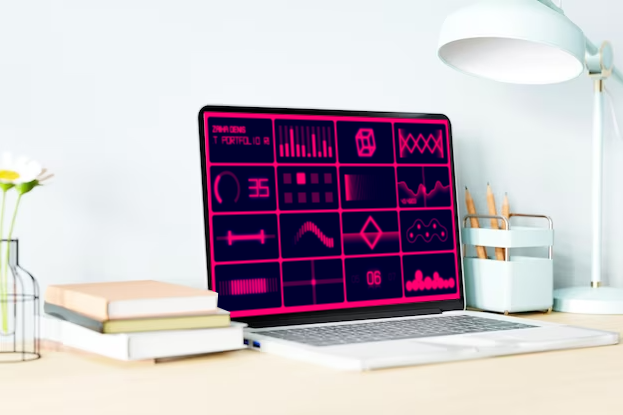

## Replay - kids playboard like UI/UX

I often remember the game board I had in my childhood. I could sit for hours, mesmerized, pressing all these buttons, 
sliders, and knobs. Who would have thought that in the future I would connect my life with UI/UX. It is quite possible 
that my favorite toy influenced my choice. Nowadays, there are many different toys for children, but they usually imitate 
biological entities. The implication that your toy can feel something carries an undesirable emotional burden on the child. 
By playing primitive abstract actions, the child gains freedom from meanings and consequently freedom from fears. 
This project is the first in a series of abstract interfaces. Keep it simple.

